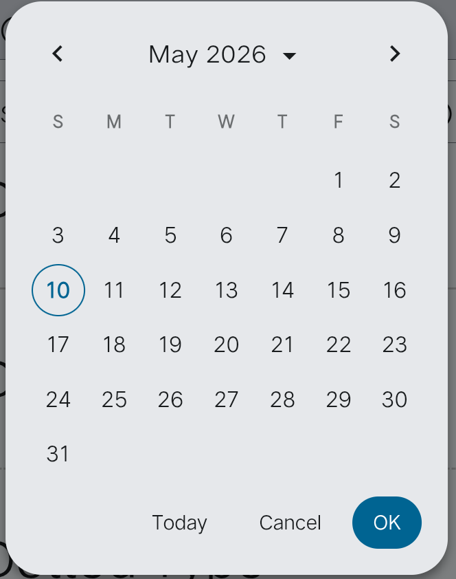

DatePicker is a prebuilt component for CarbonFramework following standard `Material Design 3` principles.

## Use Example
```jsx
<CarbonDatePicker
  Id="event_1"
  Placeholder="Event Date"
  Type="Border"
  Icon="Right"
>
</CarbonDatePicker>

<CarbonDatePicker
  Id="birth_1"
  Placeholder="Birth Date"
  Type="Filled"
  Icon="Left"
>
</CarbonDatePicker>
```

## Attribute Define:
1.  **Id** = Unique identifier for the input.
2.  **Placeholder** = Label text.
3.  **Type** = Visual style ("Filled" or "Border").
4.  **Icon** = Icon position ("Left" or "Right").

## Javascript Api
### Use of api:
```js
CarbonDatePicker.<api>
```

| Api Name | Method | Example | Extra |
| :--- | :--- | :--- | :--- |
| **Get Date** | `getSelectDate(id)` | `CarbonDatePicker.getSelectDate("event_1")` | Returns currently selected date string. |
| **Set Today** | `goToday(id)` | `CarbonDatePicker.goToday("event_1")` | Jumps the calendar view to today. |
| **Reset View** | `init(id)` | `CarbonDatePicker.init("event_1")` | Re-initializes the picker state. |
