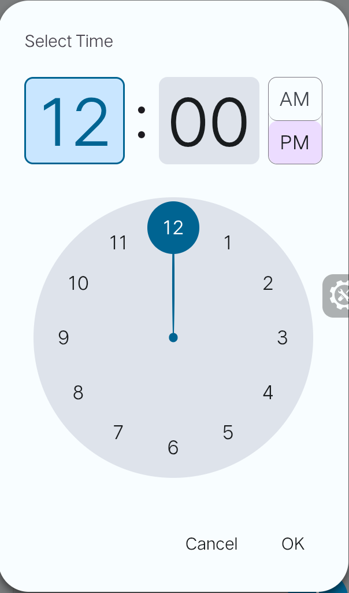

TimePicker is prebuilt component for CarbonFramework. This is following standard `Material Design 3`. 
## Use Example
```jsx
const HomeView=(
<CarbonTimePicker 
  Id="meeting_1" 
  Placeholder="Select Time" 
  Type="fill"
  Format:"24"
  Icon:"Left/Right"
  >
</CarbonTimePicker>

<CarbonTimePicker 
  Id="alarm_1" 
  Placeholder="Set Alarm" 
  Type="border"
  Format:"12"
  Icon:"Left/Right"
  >
</CarbonTimePicker>
);
```
## Attribute Define
1.  Id = Id
2.  Placeholder = Name
3. Type = Filled/Border
4. Icon = Left/Right
5. Format = 12 or 24
## Javascript Api
### Use of Api
```js
CarbonTimePicker.<api>
```

| Name         | Methods                | Example                                             |
| :----------- | :--------------------- | :-------------------------------------------------- |
| **Get Time** | `getTime(id)`          | `CarbonTimePicker.getTime("meeting_1")`             |
| **Set Time** | `setTime(id, timeStr)` | `CarbonTimePicker.setTime("meeting_1", "10:30 AM")` |
| **Clear**    | `removeTime(id)`       | `CarbonTimePicker.removeTime("meeting_1")`          |
|              |                        |                                                     |


