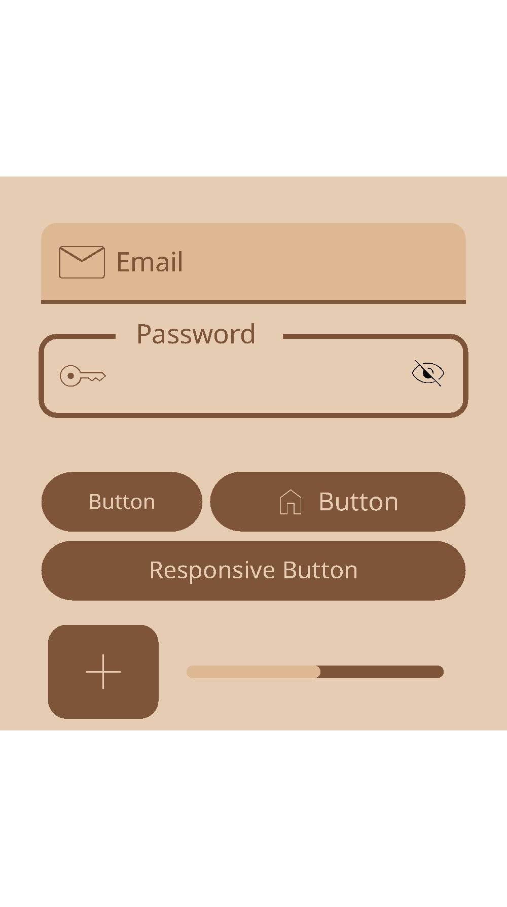

# CarbonFramework



Carbon Framework is a UI library designed for Android App Development, providing a vast collection of prebuilt components, themes, and Material Design 3 widgets. It aims to simplify the development process by offering ready-to-use components that follow modern design principles.

## 🚀 Key Features

- **Large Collection of Prebuilt Components**: Includes ActionSheets, Alerts, DatePickers, Drawers, and more.
- **Material Design 3**: Built with MD3 guidelines in mind for a modern look and feel.
- **Theming Support**: Easy to customize and apply different themes to your application.
- **Carbon Build API**: A powerful core API for efficient DOM manipulation and component creation.
- **CLI Tools**: Built-in CLI for project management, bundling, and package installation.

## 📁 Project Structure

```text
.
├── Engine/           # Framework Core (Maintained by owner. Do not modify.)
│   ├── Core/         # Core logic and Build API
│   ├── Debug/        # Debugging tools
│   ├── Prebuilt/     # Prebuilt Material Design 3 components
│   ├── Style/        # Core styles
│   └── Themes/       # Core themes
├── Main/             # User Application Code
│   ├── TopScript/    # Executes at the very start of the page
│   ├── PreScript/    # Runs before all views are set
│   ├── Script/       # Application logic (generally PageView render code)
│   ├── Views/        # UI components and layouts (JSX)
│   ├── Style/        # User-defined styles
│   ├── Themes/       # User-defined themes
│   ├── PostScript/   # Runs after all Script/ folder scripts have executed
│   └── BottomScript/ # Executes after the end of the code
└── Package/          # Dependencies managed via CLI
```

### 🛠 Development Guidelines
- **User Code**: Users should write their JSX code in `Main/Views` and their logic in `Main/Script`.
- **Scripts**:
  - `TopScript`: Start of page execution.
  - `PreScript`: Before views are initialized.
  - `PostScript`: After main scripts.
  - `BottomScript`: At the end of the page.
- **⚠️ Caution**:
  - Only edit files within the `Main` folder.
  - **Do not modify or delete** the following protected files as it may break the UI or functionality:
    - `Main/PostScript/PixelGrid.js`
    - `Main/PreScript/Themes.js`
    - `Main/Themes/Carbon.Material.Themes.js`
    - `Main/Script/MainView.js`
    - `Main/Views/MainView.jsx`
    - `Main/Views/HomeView.jsx`
  - The `Engine` folder is strictly maintained by the owner. Modifications may cause project instability.
  - The `Package` folder should be managed via the CLI. Manual changes are risky. `Main.build`, `Engine.build`, and `Package.build` are auto-updated by the CLI.

## 🛠 Getting Started (CLI Usage)

The Carbon CLI provides tools for project assembly and package management. **Node.js is required** to run the CLI.

> [!IMPORTANT]
> Always run the sync command after any file change (add, remove, rename, etc.) and before building or starting the live server:
> ```bash
> node CarbonCli.js --sync
> ```

### Running the Live Server
To preview your application, run:
```bash
node LiveServer.js
```

### Build Commands
- **Full Build**: `node CarbonCli.js --carbon-framework --build`
- **JS Bundling**: `node CarbonCli.js --build-js`
- **CSS Bundling**: `node CarbonCli.js --build-css`

### Package Management
- **Install JS Package**: `node CarbonCli.js --install --package --js <name>`
- **Remove CSS Package**: `node CarbonCli.js --remove --package --css <name>`

For more detailed CLI information, see [CarbonCli.md](CarbonCli.md).

## 📖 Component Documentation

Explore our prebuilt components:

- [ActionSheet](Doc/Prebuilt/ActionSheet.md)
- [Alert](Doc/Prebuilt/Alert.md)
- [CodeHighlighter](Doc/Prebuilt/CodeHighlighter.md)
- [DatePicker](Doc/Prebuilt/DatePicker.md)
- [Divider](Doc/Prebuilt/Divider.md)
- [Drawer](Doc/Prebuilt/Drawer.md)
- [Elasticity](Doc/Prebuilt/Elasticity.md)
- [Fab](Doc/Prebuilt/Fab.md)
- [Gesture](Doc/Prebuilt/Grasture.md)
- [GridView](Doc/Prebuilt/GridView.md)
- [Layout](Doc/Prebuilt/Layout.md)
- [PageView](Doc/Prebuilt/PageView.md)
- [PixelEngine](Doc/Prebuilt/PixelEngine.md)
- [Scroll](Doc/Prebuilt/Scroll.md)
- [Select](Doc/Prebuilt/Select.md)
- [TimePicker](Doc/Prebuilt/TimePicker.md)

## 📚 Tutorials & Examples

- [Core Build API Tutorial](Example/Core_JavaScript/Carbon_Build_Api.md)
- [NativeToast Example](Example/NativeToast/md/NativeToast.md)
- [Svg Example](Example/Svg/md/Svg.md)

## 📄 Release History

Check out the latest updates in [Release.md](Release.md).

## ❤️ Thanks

Special thanks to the following open-source projects:
- [beer-css](https://github.com/beercss/beercss)
- [vue-js](https://vuejs.org/)
- [Prism-js](https://prismjs.com/)

We always appreciate them.

> [!NOTE]
> They are not official sponsors; we respect these open-source projects.
